# Fenyr TypeScript

<div align="center">


[](https://www.typescriptlang.org/)
[](https://openai.com/)
[](https://www.weex.com/)
[](LICENSE)

**Multi-Agent AI Trading System powered by GPT-5.2**

*Built for [AI Wars: WEEX Alpha Awakens](https://www.weex.com/events/promo/aiwars) Hackathon*

[Features](#-features) • [Architecture](#-architecture) • [Quick Start](#-quick-start) • [Agents](#-agents) • [SDK](#-sdk)

</div>

---

## 🎯 Overview

Fenyr is a production-grade **multi-agent AI trading system** that leverages **5 specialized AI agents** working as a team to analyze markets and execute trades on WEEX Exchange. Built with TypeScript for type safety and performance.

## ✨ Features

| Feature | Description |
|---------|-------------|
| 🧠 **5 AI Agents** | Specialized team: Analyst, Sentiment, Risk, Executor, Coordinator |
| 🔧 **11 Trading Tools** | Zod-validated function calling for GPT |
| 📊 **Full WEEX SDK** | All Market, Account, Trade, AI Log endpoints |
| 🚀 **HFT Mode** | High-frequency rapid analysis cycles |
| 📝 **AI Log Compliance** | Every decision uploaded to WEEX |
| 🛡️ **Risk Veto** | Risk Manager can override trades |
| ⚡ **Type-Safe** | Full TypeScript with strict mode |

## 🏗️ Architecture

```mermaid
flowchart TB
    subgraph Agents["🤖 Multi-Agent Team"]
        MA[Market Analyst]
        SA[Sentiment Agent]
        RM[Risk Manager]
        EX[Executor]
        CO[Coordinator]
    end

    subgraph SDK["📦 WEEX SDK"]
        MKT[Market API]
        ACC[Account API]
        TRD[Trade API]
        AIL[AI Log API]
    end

    MA --> CO
    SA --> CO
    RM --> CO
    CO --> EX
    
    EX --> TRD
    MA --> MKT
    SA --> MKT
    RM --> ACC
    EX --> AIL
```



## 🚀 Quick Start

### Prerequisites

- Node.js 20+
- npm or pnpm
- OpenAI API key
- WEEX API credentials

### Installation

```bash
# Clone
git clone https://github.com/Miny-Labs/fenyr-ts.git
cd fenyr-ts

# Install
npm install

# Configure
cp .env.example .env
# Edit .env with your API keys

# Run
npm run single
```

### Run Modes

```bash
# Single team analysis
npm run single

# HFT mode (rapid cycles)
npm run hft

# Custom
npx tsx src/index.ts --mode hft --hft-cycles 10 --hft-interval 20
```

## 🤖 Agents

| Agent | Stage | Role |
|-------|-------|------|
| 📊 **Market Analyst** | Technical Analysis | RSI, EMA, MACD signals |
| 💭 **Sentiment Agent** | Sentiment Analysis | Funding rates, OI |
| 🛡️ **Risk Manager** | Risk Assessment | Position sizing, veto power |
| ⚡ **Executor** | Order Execution | Places orders |
| 🎯 **Coordinator** | Decision Making | Consensus voting |

### Consensus Algorithm

```typescript
const weights = {
  MarketAnalyst: 0.35,
  SentimentAgent: 0.25,
  RiskManager: 0.40  // Has veto power
};

// EXECUTE: confidence >= 0.65
// ALERT: confidence 0.45-0.65
// HOLD: confidence < 0.45
```

## 📦 SDK

Full TypeScript WEEX SDK with all endpoints:

```typescript
import { createWeexClient } from './sdk/client.js';

const client = createWeexClient();

// Market
await client.getTicker('cmt_btcusdt');
await client.getCandles('cmt_btcusdt', '1H', 50);
await client.getDepth('cmt_btcusdt');
await client.getFundingRate('cmt_btcusdt');

// Account
await client.getAssets();
await client.getAllPositions();
await client.setLeverage('cmt_btcusdt', 10);

// Trade
await client.placeOrder('cmt_btcusdt', '0.0002', 1, 1);
await client.cancelOrder('cmt_btcusdt', 'orderId');
await client.placeTPSL('cmt_btcusdt', 'long', '90000', '85000');

// AI Log
await client.uploadAILog({
  stage: 'Strategy Generation',
  model: 'gpt-5.2',
  input: { rsi: 67.5, ema20: 88000 },
  output: { signal: 'BUY', confidence: 0.74 },
  explanation: 'Bullish EMA crossover with RSI momentum'
});
```

## 📁 Project Structure

```
fenyr-ts/
├── src/
│   ├── index.ts           # CLI entry point
│   ├── sdk/
│   │   ├── client.ts      # WEEX SDK
│   │   └── index.ts
│   ├── agents/
│   │   ├── base.ts        # Base agent class
│   │   ├── market-analyst.ts
│   │   ├── sentiment.ts
│   │   ├── risk-manager.ts
│   │   ├── executor.ts
│   │   ├── coordinator.ts
│   │   └── index.ts
│   └── tools/
│       ├── trading-tools.ts
│       └── index.ts
├── package.json
├── tsconfig.json
└── .env
```

## 🔗 Related

- [fenyr-trading-agent](https://github.com/Miny-Labs/fenyr-trading-agent) - Python POC (archived)
- [weex-rust-sdk](https://github.com/Miny-Labs/weex-rust-sdk) - Rust SDK
- [crates.io: weex_rust_sdk](https://crates.io/crates/weex_rust_sdk)

## 📜 License

MIT License - see [LICENSE](LICENSE) for details.

---

<div align="center">

**Made with 🤖 by [Miny Labs](https://github.com/Miny-Labs)**

</div>
